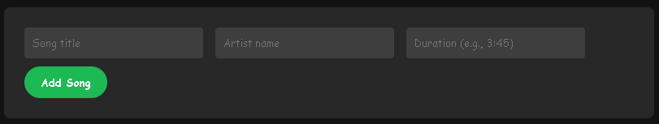

##  🎵🎶 Playlist Creator 🎵🎶
_This project was created for ICSpark 2025_

In this project, you'll create a Spotify-like music player using JavaScript arrays and objects. The HTML and CSS are already set up for you - you just need to make it work by completing the JavaScript code!


### 1. Create The Playlist Array

We're making a website where our user can add songs to a playlist, so we'll need to have a place where we can store all the information about each song. An array is perfect for this!

✅ Create an array called `playlist` at the very start of your JavaScript code. It can be empty for now, but when users enter information into the website, we'll store it into this array.

### 2. Add the addSong Function

Now we need a function that will add songs to the playlist we just made. When we press the Add Song button on the website, it'll run this function, adding the song into the playlist array.

✅ Create a function called `addSong()`

This function needs to read what the user typed into each of the input boxes, so it can add them to the playlist. There are three things it needs to know:
   - The song's title
   - The song's artist
   - The song's duration

The user is supposed to type this information into these boxes on the website:



In the HTML, these boxes are called `input` elements, that allow the user to input things into them. Here's what they look like in the HTML:

```html
<input type="text" id="songTitle" placeholder="Song title">
<input type="text" id="artist" placeholder="Artist name">
<input type="text" id="duration" placeholder="Duration (e.g., 3:45)">
```

If we want our `addSong()` function to read what's inside these input boxes, we need to use a command called `document.getElementById("id").value`. You'll learn more about what this command does later, but for now, we'll use it to take what's inside of the input boxes and store them into variables.

✅ Inside the `addSong()` function, create three variables: title, artist, and duration.

✅ Set each variable to `document.getElementById("id").value`. Replace the "id" with the id of the input element in the HTML. For example:
```javaScript
let title = document.getElementById("songTitle").value;
```

✅ Now we should have three variables that should be equal to whatever the user types in the input boxes!

### 3. Create a Song Object

Now that we have all the song information, we need to put it all together in one song before we store it into the `playlist` array. We'll put them together by creating a `Song` object!

✅ Create an object called Song with three properties, and set them to the three variables we made earlier:
   - songTitle: title,
   - songArtist: artist,
   - songDuration: duration

If you don't remember how to create an object, ask a mentor for help!

Once we've put together our `Song` object that has all of the song's information, we can add it to the `playlist` array! We can do this using the `.push()` function.

✅ Add the new `Song` object to the `playlist` array by doing `playlist.push(Song);`

### 4. Test It!

Included inside our JavaScript code is a premade function called `displayPlaylist()`, which looks through the `playlist` array and adds it to the HTML. We'll run this function at the end of our `addSong()` function to test our results.

✅ At the end of the `addSong()` function, call the `displayPlaylist()` function!

✅ Try testing out your website!


It's looking pretty great, so let's add a few finishing touches to perfect our website!

### 5. Upgrade Our Website

One thing we can do to make our website better is to clear each of the input boxes whenver the user presses the Add Song button. We'll use `document.getElementById("id").value` again, but instead of storing it in a variable, we'll just set it equal to emptyness.

✅ At the end of the `addSong()` function, clear the three input boxes by setting them equal to `''`. For example:
```javaScript
document.getElementById('songTitle').value = '';
```

✅ Test your website! Pressing the Add Song button should now clear the three boxes!

Another upgrade we can do is to prevent the song from being added if any of the boxes aren't filled. As of right now, you can add empty songs to the playlist, and we want to prevent that.

✅ On a line after creating the three song info variables, but on a line before pushing the song to the `playlist` array, use an `if` statement to check if either title, artist, or duration is equal to `''`, emptyness.

✅ If one of the inputs are empty, use the `return` command to stop the `addSong()` function from continuing on. 

✅ Add an `alert()` telling the user to "Fill in all the boxes" before stopping the function. 

✅ Test it by trying to add a song with an empty box. It should not add it, and alert the user to fill every box!

### Conclusion

Congrats! You've finished your playlist website!